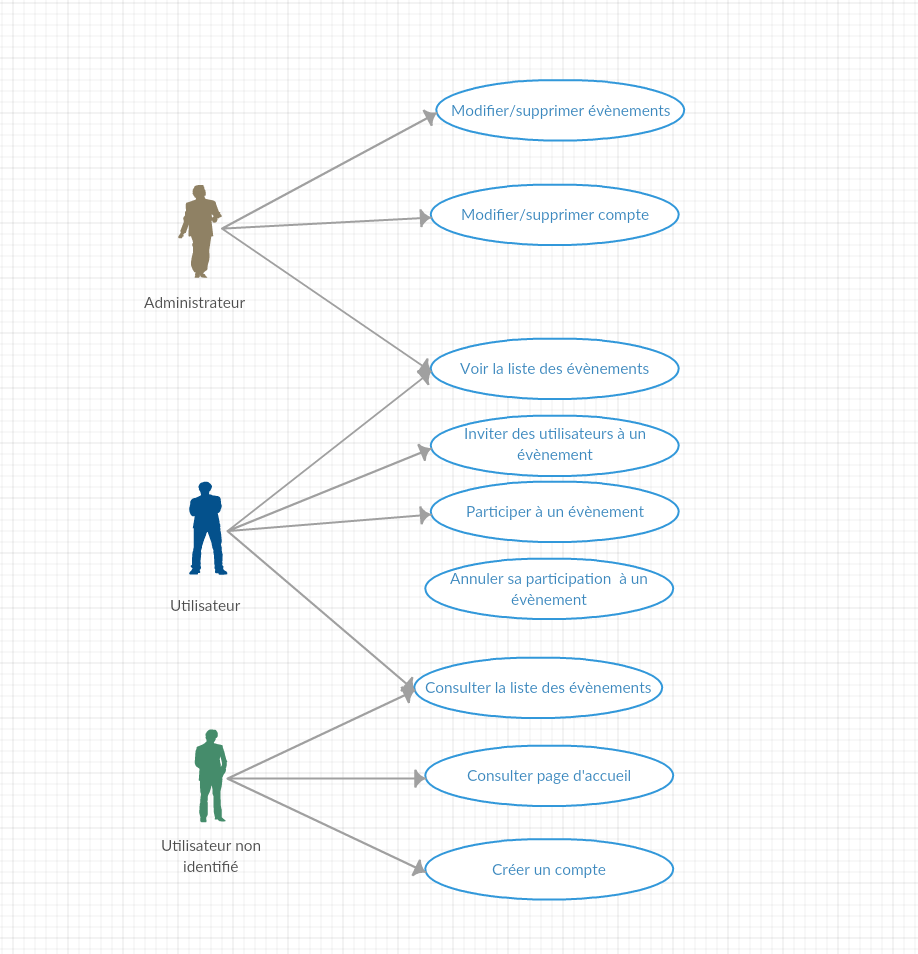
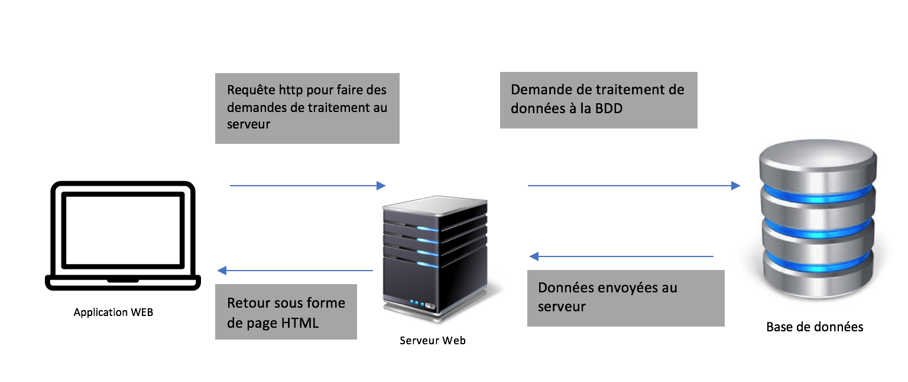

# Compte-Rendu || Projet TTP

----------

## Génie Logiciel

### Présentation du Projet - TTP (Trouve ton pote)
 Nous avons décidés de travailler à la création d'un site web d'annonces. Celui ci permettra de trouver des personnes allant aux mêmes évènements (concert, cinéma, expo etc.). Le site sera fonctionnel et toutes les informations des utilisateurs seront sauvegardés dans une BD.

### Présentation de l'équipe
* __Front end:__ Lara Laforge - Jérémy Ktourza
* __Back end:__ Tifany Madar - Nicolas Martin
* __Documentation, Organisation:__ Riwane Boudjema - Alexis Jaubourg

### Présentation des outils utilisés
 * __GitHub__
	 * Git est un logiciel de contrôle de version, ce qui signifie qu'il gère les modifications d'un projet sans écraser les anciennes parties du projet.

 * __Facebook Messenger__
	  * Facebook Messager est l'application de messagerie du géant américain Facebook et permet l'échange de message instantanée entre plusieurs personnes.

 * __Visual Studio 2015__
	  * Visual Studio 2015 est un IDE de développement conçu par Microsoft .
	  
 * __HTML & CSS__
	  * HTML est un langage de balisage qui permet de structurer des pages Web. Le CSS est un langage qui permet la mise en forme de page HTML.
	  
 * __Bootstrap__
	  * Boostrap est un framework de CSS et permet de faciliter la mise en forme de page HTML.
	
 * __Mysql__
	 * MySQL est un système de données de bases relationnelles.
 
 * __Star UML__
	  * Star UML est un outil qui permet de créer des diagrammes UML.
	
 * __Creately__
	  * Creately est un outil en ligne qui permet lui aussi de créer des diagrammes UML.
	 
* __dbdesigner__
	  * dbdesgner est un outil en ligne qui permet de créer des schéma de base de données en ligne.

## Présentation de l'organisation

----------

### Objectifs dans l'ordre chronologique
* Définir les besoins des acteurs (user story, critères d'acceptation)
* Définir les tests unitaires en fonction des besoins
* Répartir les tâches
* Concevoir l'architecture du site, ses vues, son modèle UML
* Concevoir le site, simultanément, effectuer les tests unitaires
* Documenter le code, l'installation
* Résoudre les non-conformités

### Organisation du travail
* La plupart du travail sera fait à l'IUT
* Dans les 2 semaines précédent la soutenance, des réunions seront organisés pendant les week-ends pour continuer le travail.
* Face aux nombreuses difficultés que nous avons rencontré, nous avons du modifier notre organisation de travail. En effet, nous avons eu un temps assez restreint pour développer notre application. Les rôles définis au départ ont étés ajustés de manière à pouvoir fournir une application fonctionelle en respectant les délais. 
* [Lien vers notre Trello](https://github.com/KtourzaJeremy/TTP/projects/1)

### Organisation confrontée à la réalité

Dès le début du projet, notre organisation "sur le papier" s'est confrontée à la réalité: l'équipe n'était
jamais réunie au complet pendant les 5 premières semaines !  

De plus, il nous fallait travailler avec un outil non maitrisé, découvert au début du projet pour la totalité
de l'équipe (Spring). Cet outil nous a demandé beacoup d'efforts de configuration, de paramètrage.
Un projet type fourni par M. Boutour (même si disponible depuis le début du projet ) nous aurait permis
de partir sur de meilleures bases, mais nous ne l'avons pas utilisé à temps (il ne restait plus que 2
semaines).  

Il était également difficile de se coordonner dans les tâches techniques, sans chef de projet avéré.
Nous n'avons pas réussi à nous concentrer sur "un problème à la fois", et les équipes (Front, Back ou
MOA) ont rapidement divergées vers des tâches variées, mais pas forcemment adaptées aux
besoins les plus urgent du projet, et la plupart du temps sans concertation.  

Enfin, il a été difficile de se retrouver pour travailler en semaine ou le week-end en fonction des
emplois du temps de chacun: nous avions bien identifié ce problème et voulions effectuer le travail à
l'IUT en majorité. Mais la présence d'un cours au début de la plupart des séances nous laissait peu de
temps à consacrer au projet. Et le manque de coordination entre nos équipes rendait le peu de temps
disponible, encore plus court.  

Étant donné que 2 semaines avant la date de rendu du projet, nous n'avions toujours pas résolu ces
problèmes, nous avons décidé de coder en C#, des membres de l'équipe étant déjà familiers avec ce
langage et son environnement.

## Besoins Utilisateurs

Nous avons défini 3 types d'utilisateurs. A noter: un utilisateur a ses besoins, et ceux des utilisateurs le
précédent (exemple: un administrateur a aussi les besoins d'un utilisateur non-identifié).

__Utilisateur non-identifié:__
* Consulter la page d'accueil
* Consulter les liste des annonces
* Consulter le détail d'une annonce
* Créer un compte

__Utilisateur identifié:__
* Consulter / Modifier / Supprimer son compte
* Créer une annonce
* Modifier / Supprimer une annonce
* S'inscrire à une annonce (un évènement)
* Se désinscrire d'une annonce (d'un évènement)
* Inviter des utilisateurs à un évènement

__Administrateur:__
* Modifier / Supprimer tout compte
* Modifier / Supprimer toute annonce

## User Story
N.B: En raison de la redondance entre les User Story et les Besoins Utilisateurs, nous avons choisi
de n'en présenter que quelques-uns pour exemple.

__Utilisateur non-identifié:__
* En tant qu'utilisateur, je veux avoir accès à la page d'accueil du site afin de le consulter.
* En tant qu'utilisateur, je veux consulter la liste d'annonces afin de faire mon choix.
* En tant qu'utilisateur, je veux consulter les détails d'une annonce afin de faire mon choix.
* En tant qu'utilisateur, je veux créer un compte afin de pouvoir m'inscrire à un évenement / une annonce, ou de créer un évenement / une annonce

## Critères d'acceptation

__Utilisateur non-identifié:__
* Étant donné que je rentre l'URL du site dans mon navigateur, quand je lance la requête, alors j'arrive sur la page d'accueil du site.
* Étant donné que je suis sur le site, quand je clique sur le lien "annonces", alors j'arrive sur la liste des annonces.
* Étant donné que je suis sur la page de liste des annonces, quand je clique sur le titre d'une annonce, alors j'arrive sur la page de détail de l'annonce.
* Étant donné que je suis sur le site, quand je clique sur le lien "créer un compte", alors j'arrive sur la page de création de compte.
* Étant donné que je suis sur la page de création de compte, que j'ai renseigné tous les champs en respectant les règles affichées, et que mon adresse email n'a pas déjà été associée à un compte sur le site, quand je clique sur "créer le compte", alors j'arrive sur la page "Mon Compte".

## Tests unitaires
* Page d'accueil fonctionnelle
* Liste des annonces génerée
* Détail d'une annonce accessible
* Compte présent dans la BD après création
* Compte absent / modifié dans la BD après suppression / modification
* Annonce absente / modifiée dans la BD après suppression / modification
* Participant bien enregistré dans la liste des participants
* Participant bien supprimé de la liste en cas de désinscription
* Depuis un compte admin, tous droits bien accordés

## Base de données et structure de notre application

