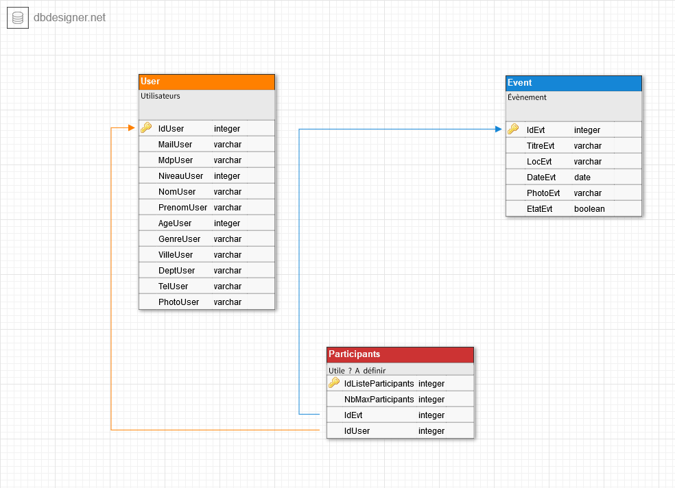

# Compte-Rendu || Projet TTP

----------

## Génie Logiciel

### Présentation du Projet - TTP (Trouve ton pote)
 Nous avons décidés de travailler à la création d'un site web d'annonces. Celui ci permettra de trouver des personnes allant aux mêmes évènements (concert, cinéma, expo etc.). Le site sera fonctionnel et toutes les informations des utilisateurs seront sauvegardés dans une BD.

### Présentation de l'équipe
* __Front end:__ Lara Laforge - Jérémy Ktourza
* __Back end:__ Tifany Madar - Nicolas Martin
* __Documentation, Organisation:__ Riwane Boudjema - Alexis Jaubourg

### Présentation des outils utilisés
 * __GitHub__
	 * Git est un logiciel de contrôle de version, ce qui signifie qu'il gère les modifications d'un projet sans écraser n'importe quelle partie du projet.

 * __Facebook Messenger__
	  * Facebook Messager est l'application de message du géant américain Facebook et permet l'échange de message instantanée entre plusieurs personnes.

 * __Visual Studio 2015__
	  * Visual Studio 2015 est un IDE de développement conçu par Microsoft .
	  
 * __HTML & CSS__
	  * HTML est un langage de balisage qui permet de structurer des pages HTML. Le CSS est un langage quant à lui qui permet la mise en forme de page HTML.
	  
 * __Bootstrap__
	  * Boostrap est un framework du CSS et permet de faciliter la mise en forme de page HTML.
	
 * __Mysql__
	 * MySQL est un système de données de bases relationnelles.
 
 * __Star UML__
	  * Star UML est un outil qui permet de créer des diagrammes UML.
	
 * __Creately__
	  * Creately est un outil en ligne qui permet lui aussi de créer des diagrammes UML.

## Présentation de l'organisation

----------

### Objectifs dans l'ordre chronologique
* Définir les besoins des acteurs (user story, critères d'acceptation)
* Définir les tests unitaires en fonction des besoins
* Répartir les tâches
* Concevoir l'architecture du site, ses vues, son modèle UML
* Concevoir le site, simultanément, effectuer les tests unitaires
* Documenter le code, l'installation
* Résoudre les non-conformités

### Organisation du travail
* La plupart du travail sera fait à l'IUT
* Dans les 2 semaines précédent la soutenance, des réunions seront organisés pendant les week-ends pour continuer le travail.
* [Lien vers notre Trello](https://github.com/KtourzaJeremy/TTP/projects/1)

### Organisation confrontée à la réalité
Nous avons rencontré beaucoup de soucis techniques, nous empêchant d'avancer au rythme que nous avions choisi de suivre.
L'utilisation de Spring en particulier, nous a demandé beaucoup d'efforts de configuration, de paramètrage.

Finalement, nous avons décidé d'implémenter et de coder une application en C# qui soit fonctionnelle. Le laps de temps qui nous restait à donc été dédié entièrement à la production de notre application et de ses fonctionnalités primaires.

## Besoins Utilisateurs

Nous avons défini 3 types d'utilisateurs:  
__Utilisateur non-identifié:__
* Consulter la page d'accueil
* Consulter les liste des annonces
* Consulter le détail d'une annonce
* Créer un compte

__Utilisateur identifié:__
* Consulter / Modifier / Supprimer son compte
* Créer une annonce
* Modifier / Supprimer une annonce
* S'inscrire à une annonce (un évènement)
* Se désinscrire d'une annonce (d'un évènement)

__Administrateur:__
* Modifier / Supprimer tout compte
* Modifier / Supprimer toute annonce

## Tests unitaires
* Page d'accueil fonctionnelle
* Liste des annonces génerée
* Détail d'une annonce accessible
* Compte présent dans la BD après création
* Compte absent / modifié dans la BD après suppression
* Annonce absente / modifiée dans la BD après suppression / modification
* Participant bien enregistré dans la liste des participants
* Participant bien supprimé de la liste en cas de désinscription
* Depuis un compte admin, tous droits bien accordés

## User Story

> Je m'ajoute ou m'enlève à un évènement
> Je recherche ou consulte les évènements
> En tant que membre, je peux proposer un/des évènement(s)
> En tant que membre, je peux supprimer mon ou mes évènements
> En tant que membre, je peux annuler mon évènement
> En tant que membre, je peux modifier mon compte
> En tant qu'utilisateur lambda, je peux créer un compte

## Base de données et structure de notre application

